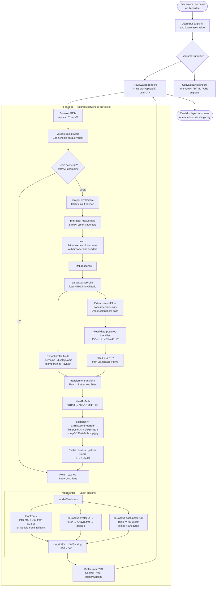

# Request Workflow

End-to-end flow from the moment a user submits their Letterboxd username.



## Key decision points

### Cache hit vs miss
On a cache hit the scraper, parser, and transformer are all skipped. Only the renderer runs (font + image fetching still happens on every request since the SVG is not cached, only the stats JSON is).

### filmId extraction
Letterboxd renders its film grids entirely in JavaScript. The `img` tag in server-rendered HTML always points to the empty placeholder. The numeric film ID is available in `data-postered-identifier` without JavaScript execution:
```
data-postered-identifier = {"lid":"21aa","uid":"film:48113","type":"film"}
```
The parser reads this attribute and extracts `48113` from `uid`.

### VP8L rejection
Letterboxd's empty-poster placeholder is a 42-byte VP8L (lossless) WebP. Satorio's wasm image decoder only handles lossy VP8/VP8X and crashes on VP8L. The renderer detects VP8L by checking bytes 12–15 (`56 50 38 4c` = "VP8L") and returns `null`, which renders as a text-only placeholder div instead.

### Proxy fallback (scraper)
If the direct `fetch` to letterboxd.com fails after 3 retries, the scraper falls back to allorigins.win and then corsproxy.io as CORS proxy mirrors. This adds latency but improves reliability from Vercel's network.
```
